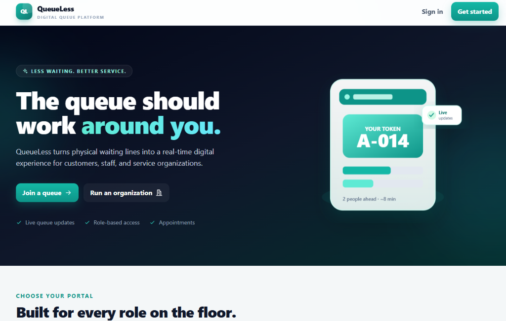
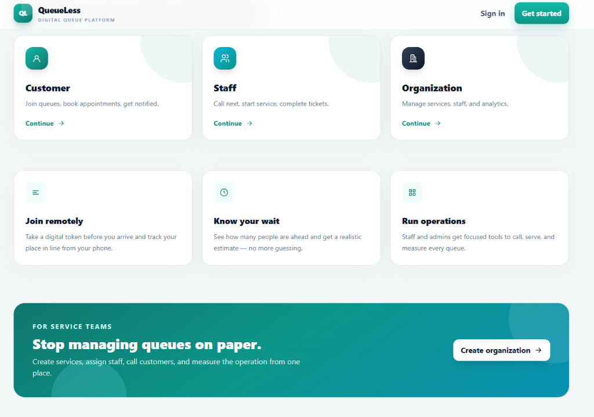
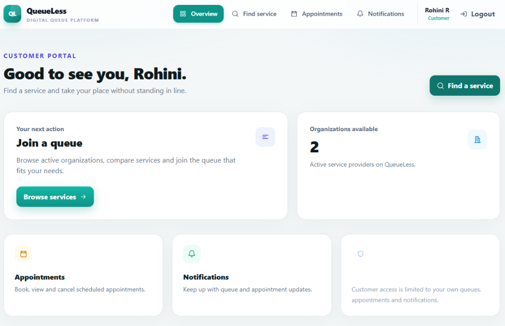
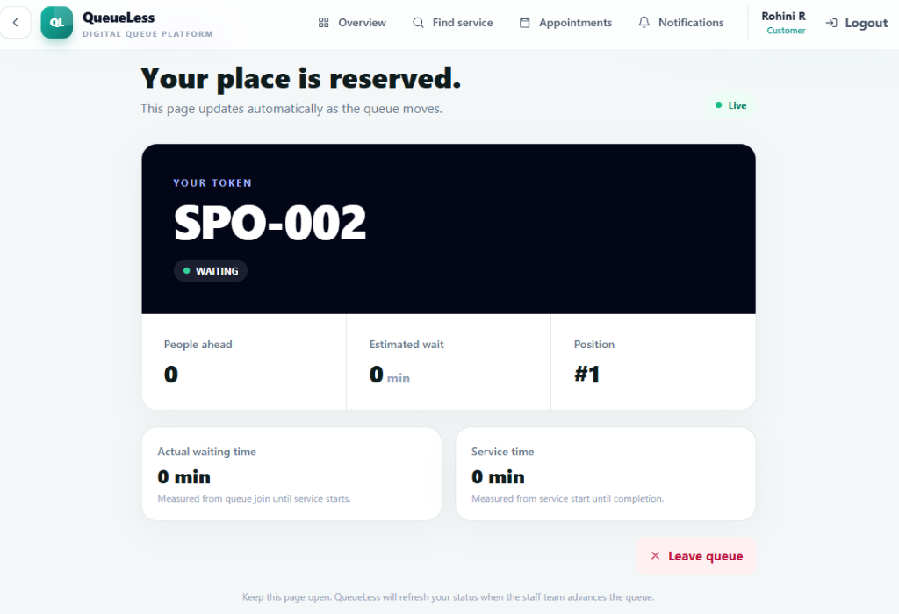
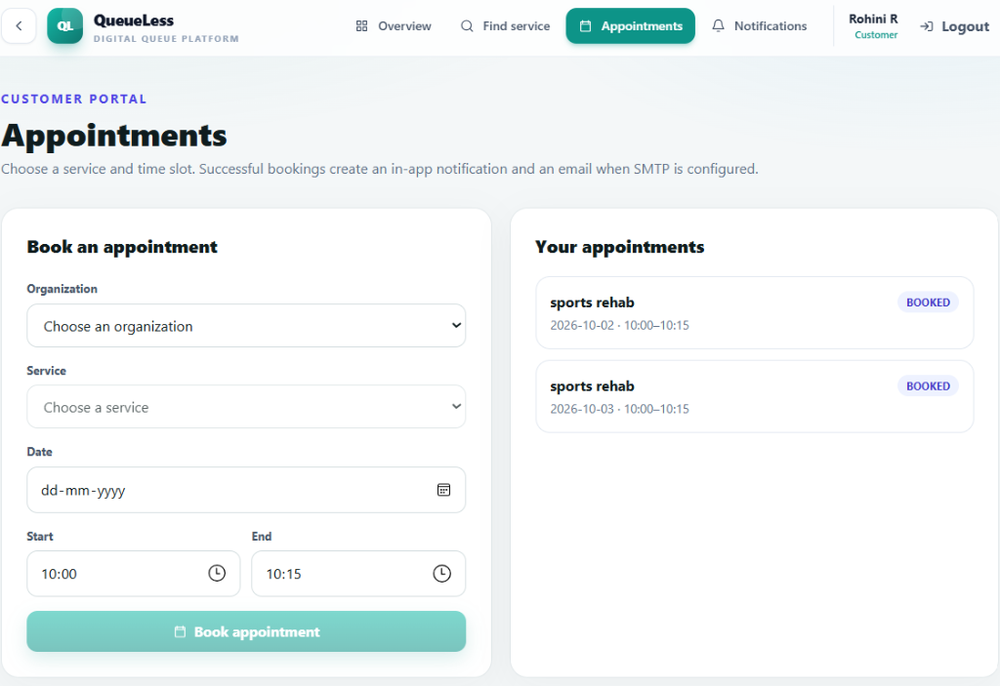
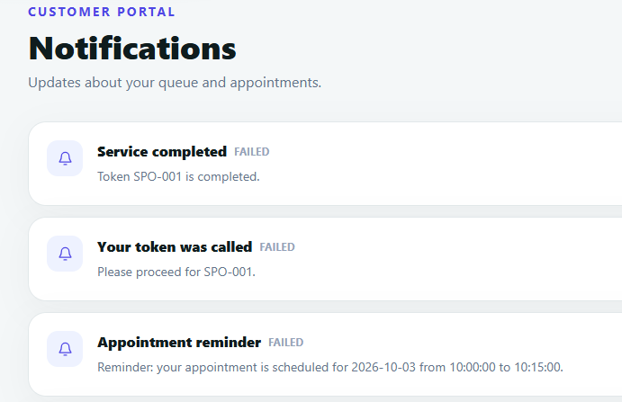
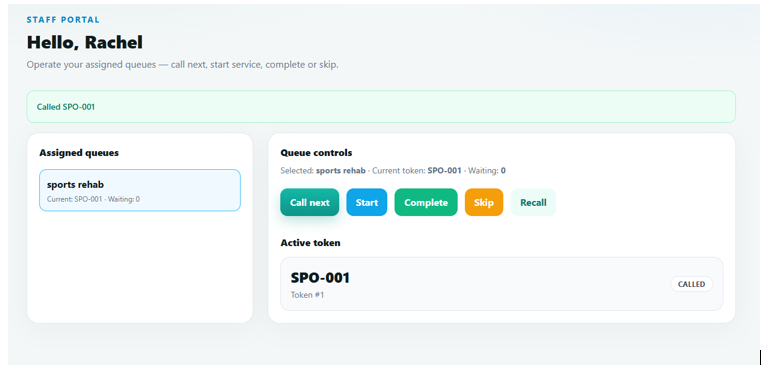
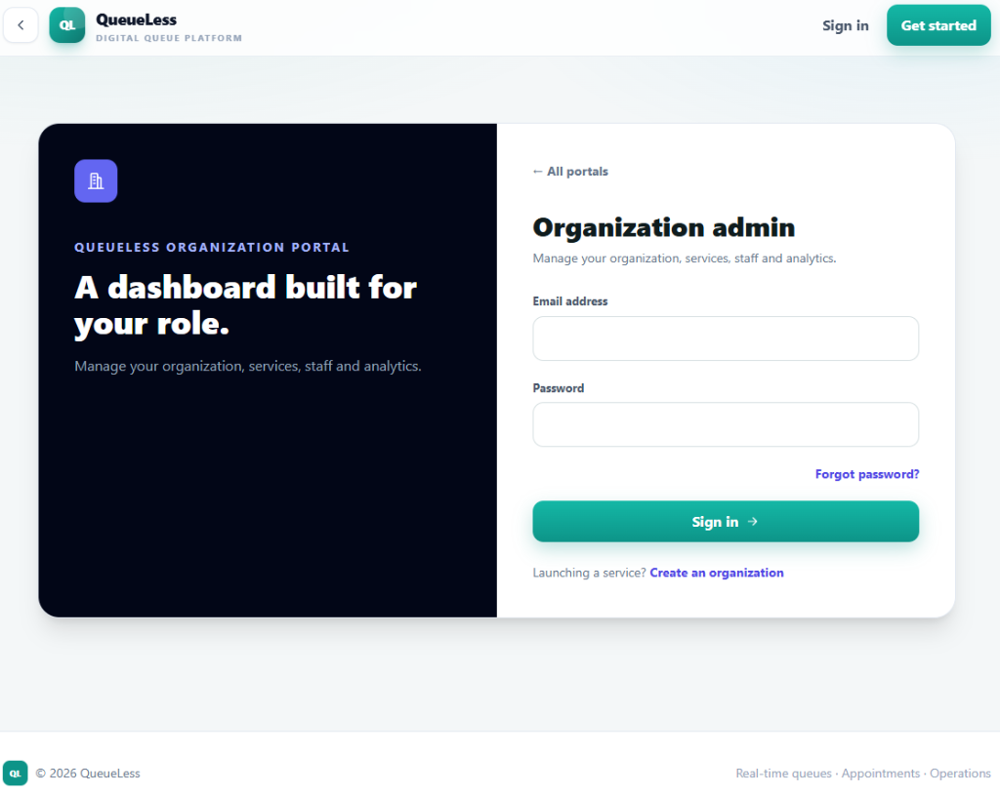
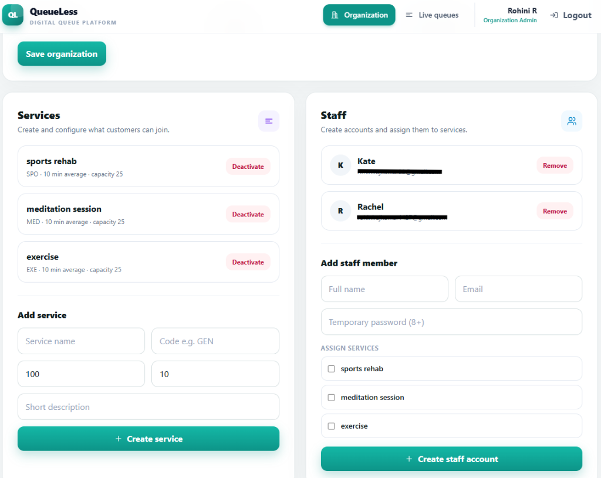
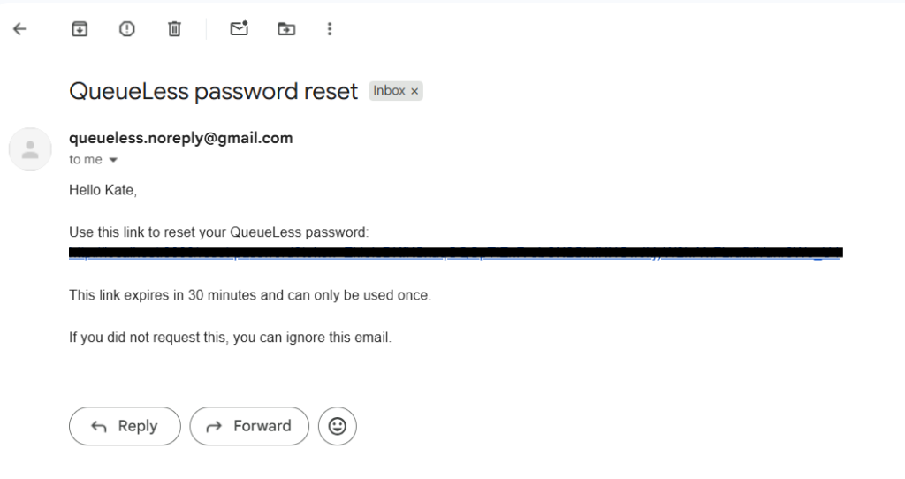

# QueueLess — Real-Time Queue & Appointment Management System

QueueLess is a full-stack, multi-tenant SaaS application that replaces physical waiting lines with digital FIFO queues, real-time live updates, staff controls, appointment scheduling, and email notifications.

---

## Tech Stack

| Layer | Technologies |
|---|---|
| **Frontend** | React 19, TypeScript, Vite, Tailwind CSS, TanStack Query |
| **Backend API** | FastAPI, Python 3.12, SQLAlchemy 2 (Async), asyncpg, Pydantic v2 |
| **Database** | PostgreSQL 16 (Single source of truth) |
| **Caching & Broker** | Redis 7 |
| **Task Queue** | Celery 5 (sync prefork workers) + Celery Beat |
| **Security & Auth** | Argon2id password hashing, Stateless JWT (Access + Refresh tokens), RBAC |
| **Real-Time** | WebSockets + polling fallback |
| **Testing & Load** | Pytest, Playwright (E2E), Grafana k6 |
| **DevOps** | Docker & Docker Compose, Gunicorn + Uvicorn workers |


---

## Screenshots & UI Showcase

### 1. Landing & Role Portals
Digital queue platform landing page with direct role navigation and real-time waiting line highlights.





---

### 2. Customer Portal & Real-Time Queueing
Customers browse services, join digital queues remotely, track live positions, schedule appointments, and receive status updates.









---

### 3. Staff Counter Console
Staff counter console for operating assigned queues in real time — calling the next token, starting service, completing, skipping, or recalling customers.



---

### 4. Organization Administration
Dedicated management portal for creating services with custom capacities and average service times, configuring operating hours, and assigning staff members.





---

### 5. Transactional Email Delivery
Asynchronous transactional emails dispatched via Celery background workers and Gmail SMTP for appointment reminders and secure password resets.



---

## Project Structure

```text
QueueLess/
├── backend/
│   ├── app/
│   │   ├── api/v1/          # REST endpoints (auth, queues, appointments, orgs)
│   │   ├── core/            # Config, database engines, security, Argon2/JWT
│   │   ├── models/          # SQLAlchemy ORM models
│   │   ├── schemas/         # Pydantic validation schemas
│   │   ├── services/        # Business logic (FIFO queue locking, auth, emails)
│   │   ├── websocket/       # Real-time WebSocket connection manager & broadcaster
│   │   └── workers/         # Celery background tasks & beat schedules
│   ├── migrations/          # Alembic database migration revisions
│   ├── tests/               # Pytest suite (health, auth, queue concurrency locking)
│   ├── seed.py              # Idempotent development demo seeder
│   └── Dockerfile
├── frontend/
│   ├── src/
│   │   ├── components/      # UI components & shared layouts
│   │   ├── pages/           # Customer, Staff, Admin, and Queue views
│   │   ├── services/        # Typed API client
│   │   └── store/           # Zustand authentication state
│   ├── e2e/                 # Playwright end-to-end test specs
│   └── Dockerfile
├── docs/
│   └── screenshots/         # UI showcase and preview images
├── loadtests/
│   └── queueless.js         # k6 stress test script (100 concurrent VUs)
└── docker-compose.yml       # Orchestrates DB, Redis, Backend, Worker, & Frontend
```

---

## Quick Start (One Command)

### Prerequisites
- Docker Desktop

### Run the App
```bash
docker compose up --build
```

- **Frontend:** http://localhost:3000
- **API Docs (Swagger):** http://localhost:8000/docs
- **Health Check:** http://localhost:8000/health

### Demo Login Accounts

| Role | Email | Password |
|---|---|---|
| **Org Admin** | `admin@queueless.example.com` | `Admin123!` |
| **Staff** | `staff@queueless.example.com` | `Staff123!` |
| **Customer** | `customer@queueless.example.com` | `Customer123!` |

---

## Email Notifications (Gmail SMTP)

QueueLess dispatches transactional emails for appointment confirmations, upcoming reminders, and password resets:
- **Asynchronous Delivery**: Fast, non-blocking requests. Emails are stored as pending records in PostgreSQL and swept every 30 seconds by a background Celery Beat worker.
- **Gmail SMTP Integration**: Works out-of-the-box via Gmail with a 16-character App Password configured in `.env`.
- **Fault-Tolerant Delivery**: Uses `SELECT FOR UPDATE SKIP LOCKED` so concurrent worker processes never double-deliver emails. Transient delivery errors (SMTP/network exceptions) are retried via Celery's autoretry with backoff, but once a notification is explicitly marked FAILED (e.g. permanent SMTP rejection, or no SMTP configured) it is not re-queued by the sweeper, since the sweeper only selects PENDING rows (see Known Limitations).

---

## Key Engineering Highlights

1. **Transactional FIFO Queue (Zero Token Collisions)**:
   - Uses PostgreSQL row-level locking (`SELECT ... FOR UPDATE`) on the queue row during token generation.
   - Calling next token uses `SKIP LOCKED` to prevent duplicate assignments even under heavy concurrent staff calls.
   - Guaranteed sequential token numbers with database-level unique constraints.

2. **Isolated Database Layers**:
   - **FastAPI Backend**: Fully asynchronous using `SQLAlchemy + asyncpg` connection pools for high-throughput I/O.
   - **Celery Workers**: Synchronous connections using `psycopg` to prevent event-loop conflicts across forked background processes.

3. **High-Performance Redis Caching**:
   - Organization and service directories are cached in Redis with a 45-second TTL.
   - Automatically invalidated on updates/creates, delivering sub-180ms read responses.

4. **Resilient Real-Time Updates (WebSocket + Redis Pub/Sub + Polling Fallback)**:
   - WebSocket updates now fan out correctly across all worker processes via Redis Pub/Sub (`ws:queue:{queue_id}`), broadcasting live queue changes to connected clients across workers. An automatic TanStack Query polling fallback provides resilience during network drops.

5. **Atomic Appointment Conflict Prevention**:
   - Time-slot validation executes inside strict database transactions, preventing double-booking the same service's time slot; does not yet prevent double-booking a specific staff member across services.

6. **Test Data Isolation (`is_test` Architecture)**:
   - CI and k6 load test organizations are tagged with an `is_test` flag and composite indexes, ensuring high-concurrency benchmarks never pollute customer-facing organization directories.

7. **Enforced Rate Limiting**:
   - Real rate limiting is now enforced using SlowAPI backed by Redis (with graceful in-memory fallback), pulling limits directly from `config.py`: login, registration, and password reset are limited to 5 requests/minute (`rate_limit_login`), queue join to 10 requests/minute (`rate_limit_queue_join`), and general endpoints to 100 requests/minute (`rate_limit_general`).

---

---

## Verification & Test Results

### 1. Automated Pytest Suite
Verifies API health, Argon2id round-trips, and concurrent queue locking:
```text
tests/test_api.py::test_health                                           PASSED
tests/test_core.py::test_password_hashing                                PASSED
tests/test_core.py::test_fifo_ordering_model                             PASSED
tests/test_queue_concurrency.py::test_concurrent_join_queue_assigns...   PASSED
tests/test_queue_concurrency.py::test_concurrent_call_next_never...      PASSED

============================== 5 passed in 3.32s ===============================
```

### 2. k6 Load Test Results (100 Concurrent Virtual Users)
Tested end-to-end customer journey (Login -> Fetch Organizations -> Fetch Services -> Join Queue):

| Metric | Result | Note |
|---|---|---|
| **HTTP Request Failure Rate** | **0.00%** (0 / 1,016 errors) | Zero dropped requests under peak load |
| **Functional Checks** | **100% Passed** (914 / 914) | All token and login contracts held |
| **Cached Org Listing** | **~173 ms flat** | Served instantly from Redis |
| **Cached Services Listing** | **~90 ms flat** | Zero database pressure on repeat reads |
| **Queue Concurrency** | **Passed** | No token duplicates or race conditions |

---

## Running Tests Locally

```bash
# Run backend concurrency & unit tests inside Docker
docker compose exec backend pytest -v

# Run k6 load test (requires k6 or Docker)
docker run --rm -v "${PWD}/loadtests:/loadtests" --network="queueless-new_default" grafana/k6:latest run -e BASE_URL=http://backend:8000 -e VUS=100 -e DURATION=30s /loadtests/queueless.js
```

---

## Production Deployment

QueueLess supports two primary deployment strategies:

### Option A: Single VPS (Docker Compose + Automated SSL)
Best for cost efficiency (e.g., AWS EC2, DigitalOcean, Hetzner, or Linode):
1. Install Docker and Docker Compose on Ubuntu.
2. Clone the repository and configure `.env` with production secrets.
3. Start the containers:
   ```bash
   docker compose up -d --build
   ```
4. Point a reverse proxy (such as Caddy or Nginx) to the containers for automatic Let's Encrypt HTTPS:
   - Frontend: Reverse proxy to `localhost:3000`
   - Backend API & WebSockets: Reverse proxy to `localhost:8000`

### Option B: Managed Cloud Services
- **Frontend**: Deploy `frontend/` to Vercel or Cloudflare Pages with build argument `VITE_API_URL=https://api.yourdomain.com/api/v1`.
- **Backend API & Celery Worker**: Deploy on Render or Railway from `backend/Dockerfile` as two instances (one web service for Gunicorn/FastAPI, one background worker for Celery).
- **Databases**: Use managed PostgreSQL (Neon, Supabase) and managed Redis (Upstash).


